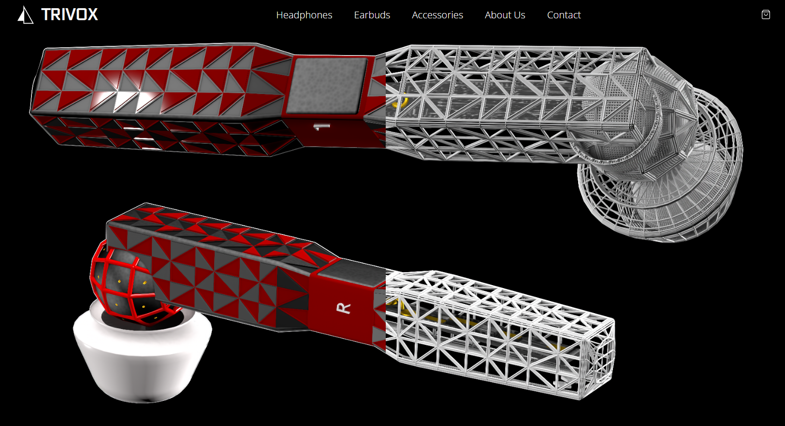

# Trivox Earbuds Website



A modern, responsive website showcasing Trivox Earbuds - a next-generation audio solution that combines cutting-edge technology, sleek design, and superior sound quality.

## Table of Contents
- [Overview](#overview)
- [Features](#features)
- [Technologies](#technologies)
- [Project Structure](#project-structure)
- [Getting Started](#getting-started)
- [Development](#development)
- [Contributing](#contributing)
- [License](#license)
- [Contact](#contact)

## Overview
Trivox Earbuds represents the future of personal audio, offering an immersive listening experience through innovative technology and premium design. This website serves as the digital showcase for our product, providing visitors with comprehensive information about features, specifications, and purchasing options.

## Features
- **Responsive Design**: Seamless experience across all devices (desktop, tablet, mobile)
- **Interactive UI**: Engaging user interface with smooth animations and transitions
- **Product Showcase**: Detailed product information and specifications
- **Contact Integration**: Easy-to-use contact form for customer inquiries
- **Performance Optimized**: Fast loading times and smooth interactions
- **Accessibility**: WCAG compliant design for all users

## Technologies
### Frontend
- HTML5
- CSS3
- JavaScript (ES6+)
- SASS/SCSS
- Tailwind CSS

### Animation & Effects
- GSAP (GreenSock Animation Platform)
- Custom CSS animations

### Development Tools
- Git for version control
- Modern build tools (TBD)
- Deployment platform (TBD)

## Project Structure
```
trivox-earbuds/
├── assets/          # General assets
├── css/            # Compiled CSS files
├── fonts/          # Typography files
├── images/         # Image assets (SVG, JPG, PNG)
├── js/             # JavaScript files
├── sass/           # SASS/SCSS source files
├── video/          # Video and animation files
└── index.html      # Main HTML file
```

## Getting Started

### Prerequisites
- Node.js (v14 or higher)
- npm or yarn package manager
- Modern web browser

### Installation
1. Clone the repository:
   ```bash
   git clone https://github.com/yourusername/trivox-earbuds.git
   ```
2. Navigate to the project directory:
   ```bash
   cd trivox-earbuds
   ```
3. Install dependencies:
   ```bash
   npm install
   # or
   yarn install
   ```

### Running the Project
```bash
npm run dev
# or
yarn dev
```

## Development
This project follows modern web development best practices:
- Mobile-first responsive design
- Semantic HTML structure
- Modular CSS architecture
- Performance optimization
- Cross-browser compatibility

## Contributing
Contributions are welcome! Please feel free to submit a Pull Request.

## License
This project is licensed under the MIT License - see the [LICENSE](LICENSE) file for details.

## Contact
For any inquiries about the project or collaboration opportunities:

- **Developer**: Opadele Emmanuel
- **Email**: [olatopmide@gmail.com](mailto:olatopmide@gmail.com)
- **LinkedIn**: [Emmanuel Opadele](https://www.linkedin.com/in/emmanuel-opadele-85b902289)

---
© 2024 Emmanuel9494. All rights reserved.
